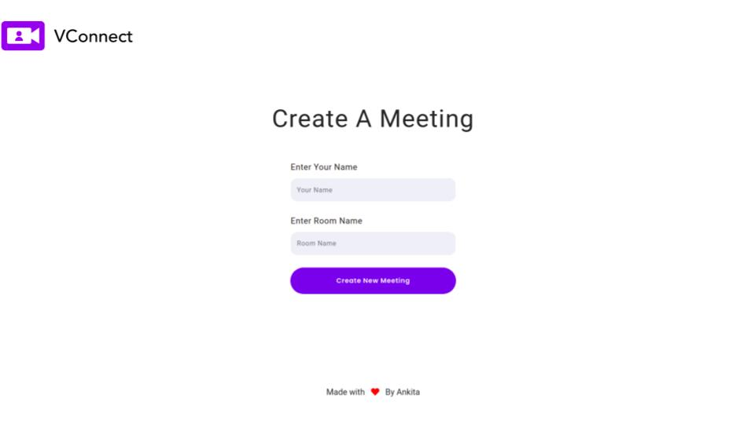
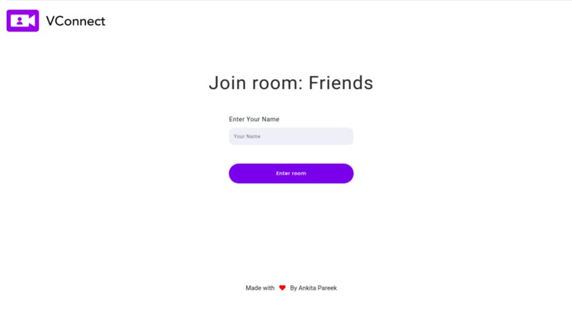
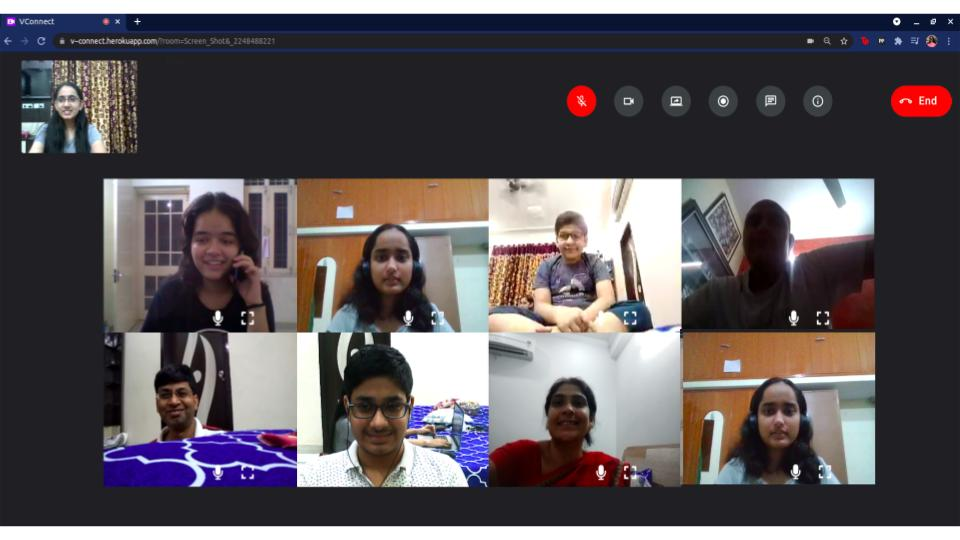

# VConnect

VConnect is a multiparty Video Conferencing Web app built using Node.js, WebRTC, and Socket.io. This project has been developed as a part of the Microsoft Engage 2021 program.

## Demo 

- Create a room:



- Join a room



- Video calling



  - The app can be tested here: https://v--connect.herokuapp.com/ 
  - Demo video: https://youtu.be/8EoVc2YffUs
  - Design Specs: https://tinyurl.com/Figma-Designs


## Features
- Multi participants video call
- Toggle audio stream (Mute and unmute)
- Toggle video stream
- Screen Sharing
- Chat functionality
- Meeting info
- Screen Recording 
- Video Recording
- Mute individual participant
- Expand any participant's video

## Prerequisites
 - node >=15.5.0
 - npm> =7.17.0


## Installation
- Clone the repository
```
git clone https://github.com/Ankita13-code/MS-Engage-Teams-Clone.git
```
- Navigate inside the cloned repository
```
cd MS-Engage-Teams-Clone
```
- Install the required node dependencies using npm
```
npm install
```
- For running the server locally, execute
```
nodemon server.js
```
- Navigate to http://localhost:3030/ to see the server running!

## Code Management

For better understanding, the following pattern has been used for writing commit messages: 

    feat: (addition of a new feature)
    rfac: (refactoring the code: optimization/ different logic of existing code - output doesn't change, just the way of execution changes)
    docs: (documenting the code, be it readme, or extra comments)
    bfix: (bug fixing)
    chor: (chore - beautifying code, indents, spaces, camel casing, changing variable names to have an appropriate meaning)
    ptch: (patches - small changes in code, mainly UI, for example color of a button, increasing size of text, etc)
    conf: (configurational settings - changing directory structure, updating gitignore, add libraries, etc)
